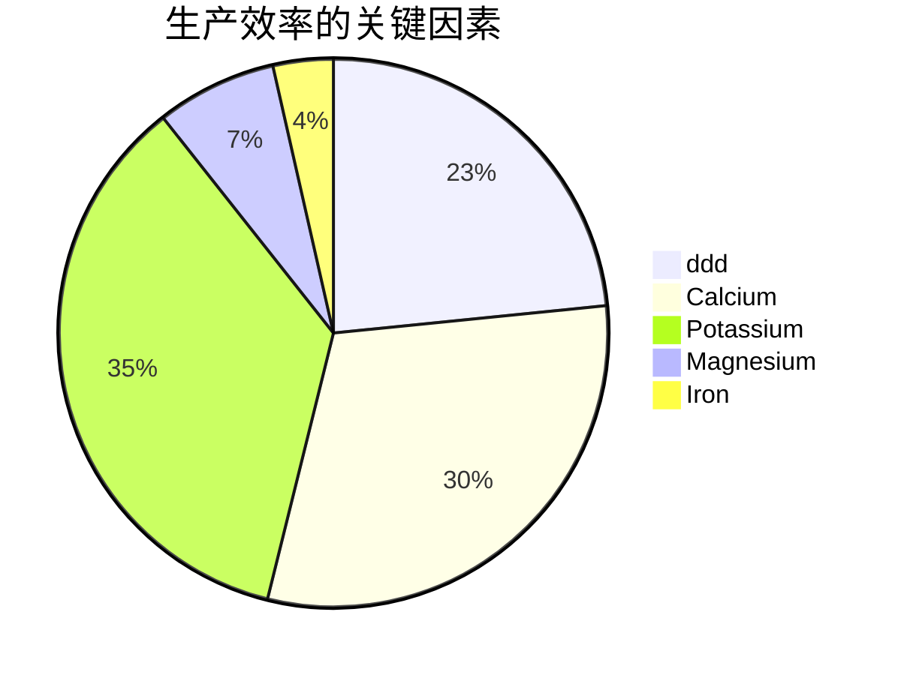
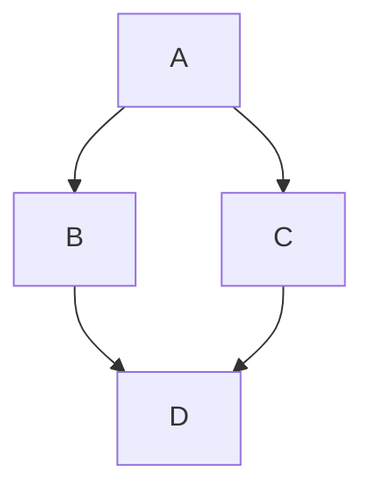
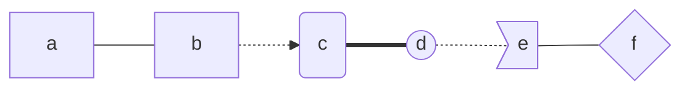

Typora是一款轻便简洁的Markdown编辑器，支持即时渲染技术，这也是与其他Markdown编辑器最显著的区别。即时渲染使得你写Markdown就想是写Word文档一样流畅自如，不像其他编辑器的有编辑栏和显示栏。

* Typora删除了预览窗口，以及所有其他不必要的干扰。取而代之的是实时预览。
* Markdown的语法因不同的解析器或编辑器而异，Typora使用的是[GitHub Flavored Markdown](https://help.github.com/articles/basic-writing-and-formatting-syntax/)。

## Markdown语言介绍

* Markdown 是一种轻量级标记语言，它允许人们使用易读易写的纯文本格式编写文档。
* Markdown 语言在 2004 由约翰·格鲁伯（英语：John Gruber）创建。
* Markdown 编写的文档可以导出 HTML 、Word、图像、PDF、Epub 等多种格式的文档。
* Markdown 编写的文档后缀为 `.md`, `.markdown`。

***

[Open: Pasted image 20250515111214.png](attachments/e0c24f28a3cd4dd040a3917bcce10edc_MD5.jpeg)


## 标题

```
# 为一级标题，快捷键为 `Ctrl + 1` 
## 为二级标题，快捷键为 `Ctrl + 2`
......
###### 为六级标题，快捷键为 `Ctrl + 6`
```

**注意：`#`之后是需要有`空格`的**

1. # 一级标题，使用1个`#`

2. ## 二级标题，使用2个`#`

3. ### 三级标题，使用3个`#`

4. #### 四级标题，使用4个`#`

5. ##### 五级标题，使用5个`#`

6. ###### 六级标题，使用6个`#`

***

## 基础

### 删除线

```
~~删除线~~(使用波浪号)
```

~~删除线~~(使用波浪号)

### 斜体

```
使用 *斜体*  或 _另一种斜体_ 来使用斜体表示方法
快捷键为 `Ctrl + i`
```

使用 *斜体*  或 _另一种斜体_ 来使用斜体表示方法

###  加粗

```
使用 **加粗的字体** 或 __另外一种加粗形式__ 来使用加粗
快捷键为 `Ctrl + B`
```

使用 **加粗的字体** 或 __另外一种加粗形式__ 来使用加粗

###  斜体+加粗

```
使用3个 * 或3个 _ 来表示 斜体+加粗
使用 ***斜体+加粗*** 或 ___另外一种斜体+加粗___ 的方式使用斜体+加粗
```

使用 ***斜体 + 加粗*** 或 ___另外一种斜体  + 加粗___ 的方式使用`斜体+加粗`

### 下划线

```
<u>我是下划线，采用了HTML语法</u>
快捷键为 `Ctrl + U`
```

<u>我是下划线，采用了HTML语法</u>

### 高亮 (需勾选 `扩展语法` 选项)

```
这是用来进行 ==高亮显示== 的语法
```

这是用来进行 ==高亮显示== 的语法

### 下标 (需勾选 `扩展语法` 选项)

````
水 H~2~O
双氧水 H~2~O~2~
````

==~== 小波浪中间的字会成为下标
	水  H~2~O
	双氧水  H~2~O~2~

### 上标  (需勾选 `扩展语法` 选项)

```
面积  m^2^
体积  m^3^
```

其实就是 ==^== 中间的字会成为上标

面积  m^2^
		体积  m^3^

### 表格

表格的语法比较麻烦，可以采用快捷键 `Ctrl + T`  快速添加表格。

使用 ==|==  来分割不同的单元，使用==-== 来分隔表头和其他内容行

```
name | price
--- | --- |
fried chicken | 19
Coco Cola | 5
```

| name          | price |
| ------------- | ----- |
| fried chicken | 19    |
| Coco Cola     | 5     |

为了使 Markdown 更清晰，==|== 和 ==-== 两侧需要至少有一个==空格==（最左侧和最右侧的 ==|== 外就不需要了）

为了美观，还可以使用空格对齐不同行的单元格，并在左右两侧都使用 ==|== 来标记单元格边界，在表头下方的分隔线标记中加入 ==:==，即可标记下方单元格内容的对齐方式：

```
| name         | price  |  quantity |
| :---         |  ---:  |  :---:    |     左对齐|右对齐|居中对齐  ，默认左对齐
|fried chicken | 19     |  300      |
|Coco Cola     | 5      |  600      |
```

### 块引用 ==>==

```
>块引用就是一个向右侧的尖括号（大于号）
>>还可以使用嵌套引用
```

>块引用就是一个向右侧的尖括号（大于号）
>
>>还可以使用嵌套引用

### 无序列表

可以使用 ==*== 、==+== 、==-== 作为标记方针列表的开头即可

```
* 可以使用 * 作为列表的标记
+ 也可以使用 + 作为列表的标记
- 还可以使用 -  作为列表标记
```

* 可以使用 * 作为列表的标记
+ 也可以使用 + 作为列表的标记

- 还可以使用 -  作为列表标记

### 有序列表

形式为： ==数字== + ==.== + ==空格==

```
1. 有序列表采用数字 +`.` + `空格` 的形式
2. 数字的序列并不会影响生成的列表序列
4. 但仍然推荐按照自然序列 （1.2.3. ...)编写
```

1. 有序列表采用数字 +`.` + `空格` 的形式
2. 数字的序列并不会影响生成的列表序列
3. 但仍然推荐按照自然序列 （1.2.3. ...)编写

```
可以使用： 数字\. 的方式来取消显示为列表（用反斜杠进行转义）
```

### 代码块

```
```语言名称  例如： ```java
```

```java
 public static void main(String[] args) {
 	//-----------------
 }
```

### 行内代码

```
通过 `代码` 的形式插入行内代码
例如，`Markdown` 就会按照代码的形式显示
```

例如，`Markdown` 就会按照代码的形式显示

### 分隔线

可在一行当中使用三个或更多的 ==*==  、==-==  、==_== 来添加分隔符：

```
***
----
____
```

***
----
____

### 超链接

格式为 ==[ link text ]== ==(link)==

==[]== 内为链接的描述，==（）== 小括号内为链接的地址

```
[Typora帮助文档](https://support.typora.io/Links/#faq)
快捷键为： Ctrl + K
```

[Typora帮助文档](https://support.typora.io/Links/#faq)

### 文件内跳转（Typora支持） 必须为标题

格式为： ==[ link text ]====(#要去哪个标题)==

```
[我想要跳转到‘表格’标题](#9. 表格)
按住Ctrl键，点击链接即可跳转。
```

[我想要跳转到‘表格’标题](#9. 表格)

### 自动链接

使用 ==<>== 包括的URL或邮箱地址会被自动转换为超链接：

```
<http://www.baidu.com>
<liugang@caict.ac.cn>
```

<http://www.baidu.com>
		<liugang@caict.ac.cn>

### 插入网上图片

格式为：

==!== ==[图片的名称]== ==(图片地址)==

```

```


### 插入本地图片

格式为：

==!== ==[图片的名称]== ==(本地文件存储的绝对或相对路径地址)==

最快的方式是直接拖曳或复制粘贴过来即可。
[[attachments/de751e4798d4bbb50efff439ced166cb_MD5.jpeg|Open: Typora快捷键.png]]
![[attachments/de751e4798d4bbb50efff439ced166cb_MD5.jpeg]]


### 居中显示

```
<center>这是要居中显示的内容</center>
```

<center>这是要居中显示的内容</center>

### 表情符号

Github的Markdown语法支持添加emoji表情，输入不同的符号码（两个冒号包围的字符）可以显示出不同的表情。

```
:smile:  :sweat_smile:  :cry: 
```

:smile:  :sweat_smile:  :cry: 

### 任务列表（ Task List）

语法： ==-== ==空格== ==[  ] 空格== 任务名称

```
- [ ] 未完成的任务
- [x] 已完成的任务
```

- [ ] 未完成的任务
- [x] 已完成的任务


### 键盘符号

```
语法：<kbd>按键名称</kbd>
<kbd>tab</kbd>   <kbd>ctrl</kbd>
```

<kbd>tab</kbd>  <kbd>ctrl</kbd>


### 目录（TOC）

输入 ==[ toc ]== 然后回车，即可创建一个“目录”。TOC从文档中提取所有标题，其内容将自动更新。


[toc]

## 其他注意事项

1. 建议打开大纲视图 `Ctrl + Shift + 1`
2. 插入表格需要顶格写，否则无法显示
3. 语法无须刻意记忆，右键可查询


## Mermaid 饼图




## Mermaid流程图

### 关键字 graph

```
graph + 流程图方向
流程图方向取值：
TB  (top bottom)上到下
BT              下到上
RL  (right left)右到左
LR              左到右
TD              上到下
```



```mermaid
graph LR
A-->B
B.->C
B==通信==>D
C-->D
```

### 节点

```
默认节点	a
文本节点	b[我是b]
圆角节点   	c(我是c)
圆形节点	d((我是d))
非对称节点	e>我是e]
菱形节点	f{我是f}
```



### 连线

```
箭头连接-->
开放连接---
虚线箭头.->或-.->
虚线开放.-或-.-或..-
粗线开放===
粗线箭头==>

标签箭头--text-->
标签开放--text---
标签虚线箭头-.文本.->
标签虚线开放-.文本.-
标签粗线箭头==文本==>
标签粗线开放==文本===
```

```mermaid
graph LR
a-->b---c.->d-.->e.-f===g==>h--text---i-.text-->j==文本==>k
```


