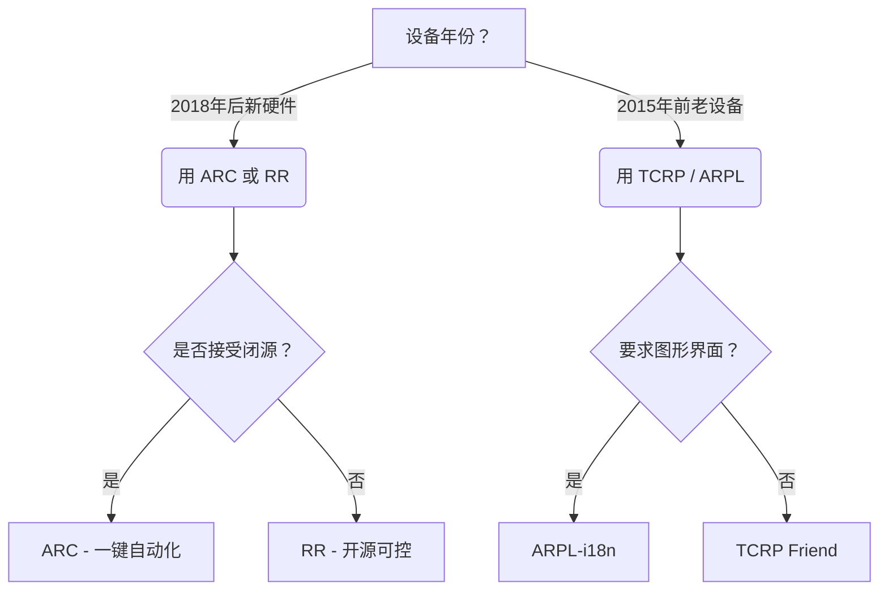

---
## 🤖 Assistant

目前主流的黑群晖引导程序主要分为 **开源免费** 和 **闭源/半商业化** 两大类，它们在兼容性、易用性和社区生态上差异显著。以下是 **2024年主流方案** 的详细对比分析：

---

### 🔧 **一、开源免费方案**
#### **1. RedPill Loader (TCRP / TCRP-Friend / RR 衍生生态)**
| **分支名称** | **核心特点** | **适用场景** |
|--------------------|-----------------------------------------------------------------------------|--------------------------------|
| **Tiny Core RedPill (TCRP)** | 初代开源支柱：<br>- **容器化内核构建**（需Linux临时系统）<br>- 驱动模块热插拔（扩展驱动）<br>- 兼容DSM 6.x~7.1+ | 开发者/高阶用户 |
| **TCRP Friend** | 改进易用性：<br>- **内置HTTP服务器**（支持本地驱动上传）<br>- 改进菜单交互 | 需频繁更换硬件的进阶用户 |
| **RedPill Recovery (RR)** <br>*(当前最活跃)* | **革命性升级**：<br>- **全内存运行**（无需本地临时系统）<br>- 自动硬件检测+驱动匹配 (Satadom/NVME/万兆网卡)<br>- **支持在线编译内核补丁** | *X86平台首选方案*<br>兼容新旧硬件 |
| **RR 衍生版**<br>(如：RR Max / RR Nightly) | 社区增强版：<br>- 预置企业级硬件驱动（LSI RAID卡、Intel X550万兆）<br>- 支持DS3622xs+/FS6400等“大船型号” | 服务器/高性能工作站用户 |

> ✅ **RR核心优势：**
> `./rploader.sh` 一行命令全自动：
>```bash
> ./rploader.sh fullupgrade now      # 升级核心  
> ./rploader.sh ext add https://github.com/pocopico/redpill-load...   # 添加驱动仓库  
> ./rploader.sh build <型号> <版本>   # 自动编译引导镜像
> ```

---

### 💰 **二、闭源/半商业化方案**  
#### **1. ARC Loader**  
| **项目定位**        | **技术亮点**                                                                 | **争议点**              |
|---------------------|-----------------------------------------------------------------------------|------------------------|
| 商业化引导器：<br>- **图形化配置界面**(UEFI Shell/WebUI)<br>- 自动化程度极高 | - **一键检测硬件+注入驱动**<br>- DSM更新无缝支持（自动重编译）<br>- 集成 **Virtual DSM** 支持 | **核心代码闭源**<br>免费版功能限制<br>高级功能需订阅（~$5刀/月）|

> ⚠️ **注意**：虽然易用性碾压开源方案，但闭源特性引发社区对**安全性**和**后门风险**的质疑。

#### **2. i18n (ARPL 汉化增强版)**  
- 经典ARPL中文版分支，已基本被ARC替代  
- 仅建议用于老设备降级安装（如DSM 6.2.4）

---

### ⚡ **三、关键能力横向对比**  
| **功能**              | RR (开源)       | ARC (闭源)      | 传统方案 (Jun's Loader) |  
|----------------------|----------------|----------------|------------------------|  
| **DSM 7.2+支持**     | ✅ 持续更新      | ✅ 官方级支持    | ❌ 已淘汰               |  
| **驱动热插拔**        | ✅ 模块化仓库    | ✅ 自动注入      | ❌ 需手动集成           |  
| **UEFI/BIOS双启**    | ✅ 完善          | ✅ 完善          | ⚠️ 仅BIOS              |  
| **HBA/RAID卡支持**   | ✅ 完备 (LSI/MegaRAID) | ✅ 企业级硬件    | ❌ 几乎无支持           |  
| **虚拟机兼容**        | ✅ ESXi/Proxmox | ✅ 深度优化      | ⚠️ 仅基础支持           |  
| **免编译运行**        | ❌ 需Linux环境   | ✅ 图形化一步完成 | ✅ 镜像即用             |  

---

### 🛠️ **四、版本选择决策树**  


---

### 🚨 **五、高危避坑指南**
1. **绝对淘汰项**：
 - **Jun's Loader (1.03b/1.04b)**： 最高仅支持 **DSM 6.2.4**，无法运行DSM7！
 - **经典ARPL**：停更于2023年，已无法支持7.2+固件签名验证。

2. **闭源风险**：
 - ARC虽便利，但深度依赖其服务器分发补丁，存在**单点故障风险**。

3. **驱动地狱**：
 - 10G/40G网卡、USB网卡需严格验证驱动兼容性（RR需查设备ID匹配驱动）。

---

### 💎 **结论推荐**
- **技术流/数据中心** → 选 **RR**（开源透明 + 驱动可控）
- **小白/家庭用户** → 选 **ARC**（省心省力，支持自动更新）
- **怀旧老设备** → 选 **TCRP-Friend/ARPL-i18n**（兼容Legacy BIOS）

> 📌 **终极警告**：
> - **DSM 7.2+ 已启用内核级反破解**，旧引导100%变砖！
> - **任何黑群晖均存被封风险**，关键数据务必多重备份！

（如需具体型号编译教程，请提供设备CPU/主板/网卡型号）
